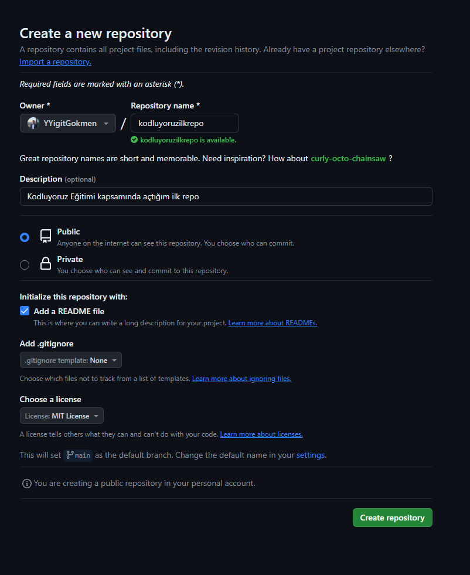

# Kodluyoruz Ilk Repo
Kodluyoruz Eğitimi kapsamında açtığım ilk repo

Kodluyoruz Ilk Repo

Bu repo [Kodluyoruz](https://kodluyoruz.org/) Front-End Eğitiminde oluşturduğumuz ilk repo. İçerisinde bir adet README dosyası, bir adet de index.html barındırıyor.





## Installation

Öncellikle projeyi clonlayın.

 ```

 
https://github.com/YYigitGokmen/kodluyoruzilkrepo.git

```
## Usage

Projeyi clonledıktan sonra Visual Studio code programında açınız.

Linux için:
 ```


cd kodluyoruzilkrepo
code .

```
## Contributing

Pull requestler kabul edilir.Büyük değişiklikler için, lütfen önce neyi değiştirmek istediğinizi tartışmak için bir konu açınız.

##### License

[Mıt](https://mit-license.org/)


